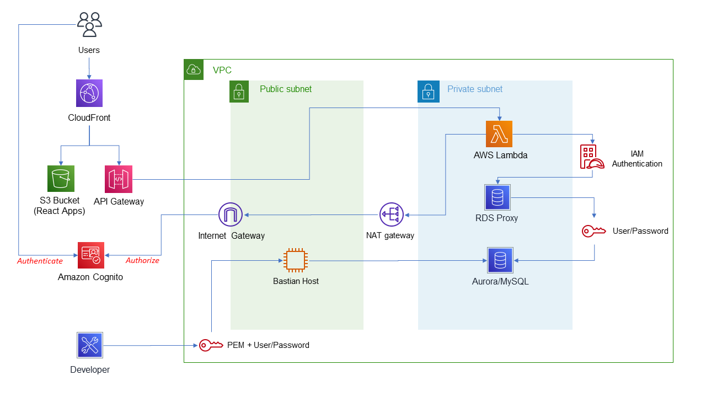

# Overview

Proof of concept, built from scratch based on the [Serverless-SaaS reference architecture](https://github.com/aws-samples/aws-serverless-saas-workshop).

## Goals

- Learn: 
  - AWS
  - Application Hosting and Design options
  - CDK deployment concepts
  - RDS and RDS Proxy
- Define patterns that can be re-used to help standardize service and feature development.
- Introduce the concept of a centralized Tenant Management system to act as the source of truth for SaaS Tenants and their associated details and configuration. *(Unified identity for tenants and their users)*
- Support runtime provisioning of Tenant specific resources to ensure that provisioning is standardized and reproducible. Ensure Tenant isolation where applicable. 
  - Example: Having an Amazon Cognito User Pool for each Tenant.

## High Level Architecture



## Build

Requirements:

- [NodeJS](https://nodejs.org/en/)
- [.NET 6.0 SDK](https://dotnet.microsoft.com/en-us/download/dotnet/6.0)
- [Java 19 SDK](https://www.oracle.com/java/technologies/downloads/#jdk19-windows)
  - [Maven](https://maven.apache.org/download.cgi)

A top level build script is used to run each components' individual build commands.

```powershell
$> .\build.ps1
```

## Deployment

The entire stack defined above can be deployed using the following command. A context variable is used to define an "environment" name that is used to derive a naming scheme for all resources in the stack and allows for multiple deployments in the same AWS account. *Note: Some account tweaking may be required to get the deployment working smoothly.*

```powershell
$> cd ./cdk
$> cdk deploy --context environment=Dev
```

Once deployed, the user interfaces will be available under the cloud front distribution domain:

**Tenant Portal App**

- https://{cloud-front-distribution-domain}/client/

**SaaS Operations Admin App:**

- https://{cloud-front-distribution-domain}/saas-operations/

**Tenant Management Api:**

- https://{cloud-front-distribution-domain}/tenant-management/api/

## Code

### Frontend Apps

#### *Tenant Portal App*

React Application that allows users to sign into their tenant context.

[./apps/client-ux/](./apps/client-ux/)

#### *SaaS Operations Admin App*

React Application that allows internal SilkRoad users to provision and manage Tenants.

[./apps/saas-operations-ux/](./apps/saas-operations-ux/)

### Backend Services

#### *TenantManagement Api*

.NET6 Service used to handle tenant provisioning and management tasks. *<span style="color:red">(Note: .NET6 was used since this was a familiar technology at the time and helped minimize the learning curve during the exploratory phases of this project. This will likely need to be migrated to a Node or Python based application in the future)</span>*

[./services/TenantManagement/](./services/TenantManagement/)

### Deployment

- [./cdk/](./cdk/)
- [./cdk-resources/](./cdk-resources/)

